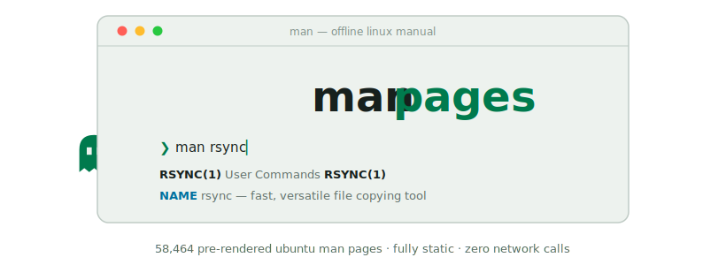
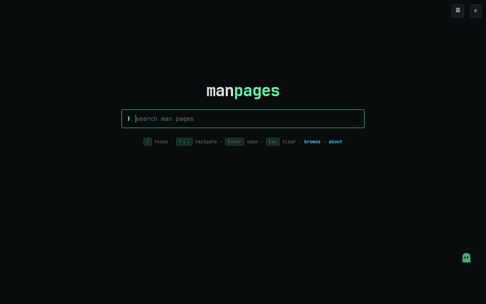
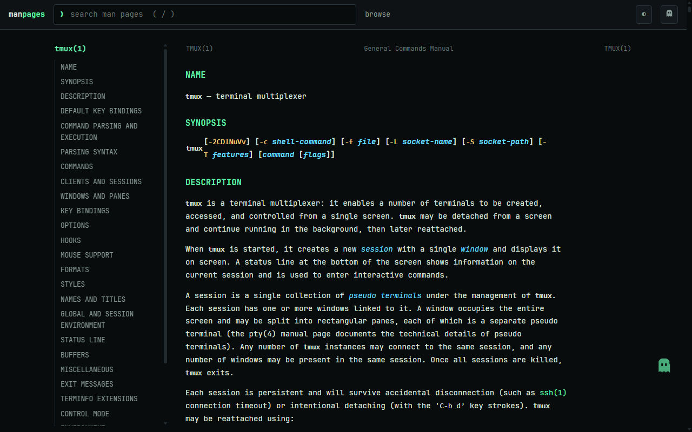

<picture>
  <source media="(prefers-color-scheme: dark)" srcset="docs/assets/cover-dark.svg" />
  
</picture>

# manpages — offline linux manual

A lightning-fast man-page lookup site. The entire site — 58,464 pre-rendered
Ubuntu 24.04 man pages (main + universe), search index, fonts, styling — is
static files committed to this repo under `docs/`. It makes **zero network
calls**: no CDNs, no external fonts, no analytics. It works on an air-gapped
GitHub Enterprise instance and even opened straight from disk.

## Features

- **Instant search** over 58k pages + 24k aliases as you type; filter by
  section with `tar 5`, `tar.5`, or list a whole section with a bare `5`
- **Browse** every section from [browse/](docs/browse/) pages; **about** page
  with corpus snapshot details
- **Cross-linked**: `name(section)` references become links when the target
  exists in the corpus; near-duplicate giants (cross-compiler manuals) are
  deduplicated into search aliases
- **Provenance**: every page footer names its source package and version;
  `build/corpus-manifest.tsv` records the full page→package map
- **Installable PWA** with a service worker: after one visit the whole shell
  is cached; visited pages work fully offline
- **Accessible**: ARIA combobox search, skip-to-content, keyboard-first
- **Print stylesheet**, recently-viewed chips, dark/light theme, themed
  scrollbars — and the ghost

## Deploy (any GitHub / GitHub Enterprise)

1. Push this repo.
2. Settings → Pages → Source: **Deploy from a branch** → branch `main`, folder `/docs`.
3. Done. No Actions, no build step, no internet access required on the server.

## Local / offline use

Open `docs/index.html` directly in a browser, or serve it:
`python3 -m http.server --directory docs`. A zip of `docs/` is a complete
portable copy (see the optional release workflow).

## Keyboard shortcuts

`/` focus search · `↑` `↓` navigate results · `Enter` open · `Esc` clear.
Theme toggle (dark/light) is in the header; it follows your OS preference by default.

## The ghost

A small ghost companion roams the pages (ported from
[Real-Fruit-Snacks/obsidian-vault-publisher](https://github.com/Real-Fruit-Snacks/obsidian-vault-publisher)). Click the
ghost button in the header for settings: mode (Roam / Cursor / Off), size,
opacity, color, and behaviors (napping, fleeing, reading along, tricks, speech
bubbles). Pet it to recolor it; drag and throw it if it misbehaves. All settings
persist locally — no network involved.

## Refreshing the corpus (internet-connected side only)

Requires WSL/Linux with `mandoc groff man-db curl dpkg-dev` installed:

    bash build/run_all.sh ~/manbuild/cache ~/manbuild/work "$(pwd)/docs"
    python3 build/smoke_test.py docs
    git add docs && git commit -m "chore: refresh corpus"

`PKG_LIMIT=200` limits the package count for a quick test run. Downloaded debs
are cached in `~/manbuild/cache` and reused on the next refresh.

To cut a release, push a tag: `git tag v1.2.3 && git push origin v1.2.3`.
The release workflow zips `docs/` and publishes it with that version's
CHANGELOG section as the notes.

## How it works

- `build/fetch.sh` finds every Ubuntu main package shipping man pages (via the
  archive `Contents` index) and downloads just those debs (sha256-verified).
- `build/unpack.sh` + `build/extract.sh` pull out English pages (sections 1–9),
  resolving `.so`/symlink aliases instead of duplicating pages.
- `build/convert.sh` renders each page with `mandoc -T html`
  (fallbacks: groff, then escaped `<pre>`; build aborts if >2% hit `<pre>`).
- `build/build_site.py` wraps pages in the app shell, links `name(section)`
  cross-references that exist in the corpus, and emits `docs/data/index.js` —
  a compact name+description index loaded as a script (works on `file://`).
- Search is ~100 lines of dependency-free JS (`docs/assets/search-core.js`).

## Licenses

- Man page content: belongs to the respective upstream Ubuntu packages (GPL and
  other free licenses) — see each page's source package.
- Styling: [terminal-workbench-design-system](https://github.com/Real-Fruit-Snacks/terminal-workbench-design-system) tokens (MIT), vendored in `docs/assets/tokens.css`.
- Font: JetBrains Mono (OFL 1.1), vendored in `docs/assets/fonts/`.
